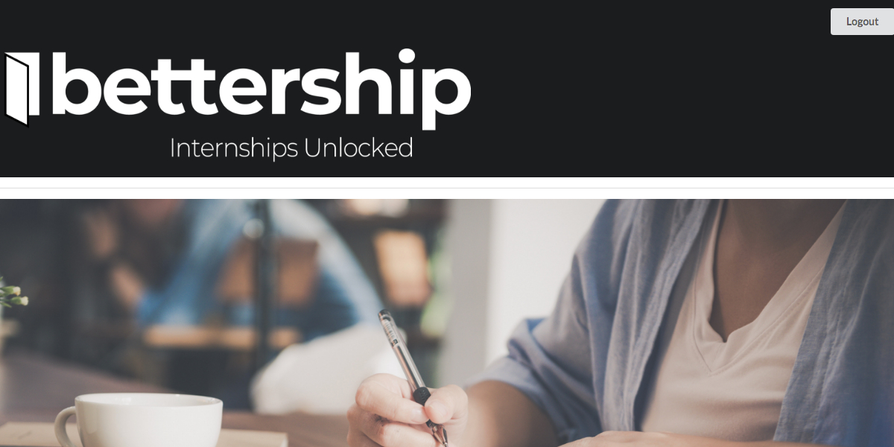

# Bettership

## About
Bettership partners with schools and institutions to list internship opportunities in the Denver Metro Area. We provide an improved matching experience for students seeking internships that will more effectively locate relevant and exciting opportunities. Bettership also creates mutual accountability by requiring students to log internship hours and provide feedback on their experience for institutions and future students alike.

## Installation

Run `npm install` to install dependencies.

## Serving

Run `npm start` to serve locally.

## Tech Used
- React
- Express
- Knex
- PostgreSQL
- Node.js
- React Semantic UI
- React Router
- Auth
- Heroku
- Firebase

## Backend Repo

[Link](https://github.com/cchooley/CHOK-server)

## Team

- [Conor Hooley](https://github.com/cchooley)
#####(https://www.linkedin.com/in/conor-hooley/)
---
- [Hayley Zulkoski](https://github.com/hayz999)
---
- [Kyle Kuberra](https://github.com/kkuberra)
---
- [Onder Gunacan](https://github.com/Gunacan)